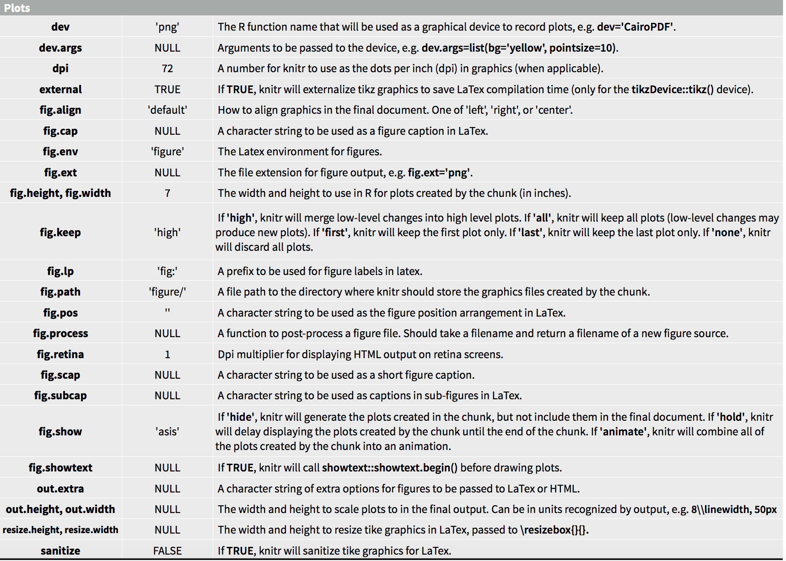

```{r setup, include=FALSE}
knitr::opts_chunk$set(echo = FALSE)
```

## Introduction

R Markdown provides an authoring framework for data science. A single R Markdown file can be use to both 

  + save and execute code
  + generate high quality reports that can be shared with an audience

R Markdown documents are fully reproducible and support dozens of static and dynamic output formats, such as 

<div style="float: left; width: 50%;">
+ web page
+ PDF 
+ MS Word
+ slide show
+ dashboard
</div>

<div style="float: right; width: 50%;">
 
+ notebook
+ handout
+ book
+ package vignette or 
+ other format.
</div>


## How It Works

This is an R Markdown file, a plain text file that has an extension `.Rmd`. 

<div style="float: left; width: 45%;">

```{r rmd_file1, out.width = "450px"}

```
</div>

<div style="float: right; width: 50%;">
The file has three types of content

+ An (optional) YAML header surrounded by `---`
+ R code chunks surrounded ` ``` `
+ text mixed with simple text formatting 

</div>

____

### A Notebook Interface

+ When the file is open the file in RStudio IDE, it becomes a notebook interface for R. 

+ Each code chunk can be run by clicking the {width=20px} icon

+ RStudio executes the code and display the results inline

### Rendering outut

+ To generate a report from the file, run the render command

```{r render_code, echo=TRUE, eval=FALSE}
library(rmarkdown)
render("Rmarkdown_Coles.Rmd")
```

+ Or, click on  {height=20%} button to render and preview 


## How It Works

+ R Markdown generates a new file that contains selected text, code and results from the .Rmd file. 

```{r knit_process, fig.align='center'}

```

+ When we run `render`, R Markdown feeds the .Rmd file to `knitr`, which executes all the code chunks and creates a new markdown (`.md`) document which includes the codes and it's output. 

+ The markdown file generated by `knitr` is then processed by `pandoc` which is responsible for creating the finished format

+ Sounds complicated? R Markdown makes it extremely simple by doing all of process into a single `render` function  or the `knit` button


## Code Chunks

The R Markdown file contains three code chunks 

<div style="float: left; width: 35%;">

```{r codechunk1, out.width = "450px"}

```
</div>

<div style="float: right; width: 50%;">
We can quickly insert chunks like these into file with 

+ the keayboard shortcut *Ctrl+Alt+I*    
   (OS X: *Cmd+Option+I*)
+ the Add Chunk  button in the editor toolbar
+ or by typing the chunk delimiters ` ```{r}` and ```

When .Rmd file is rendered, R Markdown will run each code chunk and embed the results beneath code chunk in final report
</div>

## Chunk Options

Chunk output can be customized with **knitr options**, arguments set the `{}` of a chunk header. In the previous example we use four arguments:

+ `include = FALSE` prevents code and results from appearing in the finished file. R Markdown still run the code in the chunk, and the results can be used by other chunks.

+ `message = FALSE` prevents messages that are generated by code from appearing in the finished file

+ `warning = FALSE` prevents warnings that are generated by code from appearing in the finished file

+ `fig.cap = "..."` adds a caption to graphical results 


## Knitr Options for Code Chunk

```{r knitr_option1 , out.height="550px"}

```

----


```{r knitr_option2}

```

----

```{r knitr_option3}

```


## Global Options

+ To set global options that apply to every chunk in the file, call `knitr::opts_chunk$set` in a code chunk. 

```{r global_chunk1, fig.align='center'}

```

+ Knitr will treat each option that you pass to `knitr::opts_chunk$set` as a global default that can be overwritten in individual chunk headers.

```{r globar_chunk2, fig.align='center'}

```


## Caching

+ If document rendering becomes time consuming due to long computations you can use knitr caching to improve performance. 

+ [Knitr chunk and package options](https://yihui.name/knitr/options/) describes how caching works and the [Cache examples](https://yihui.name/knitr/demo/cache/) provide additional details.


### Reference: 

+ [R Markdown Reference Guide](https://www.rstudio.com/wp-content/uploads/2015/03/rmarkdown-reference.pdf)  

+ [knitr options](https://yihui.name/knitr/options/)


## Some hack for Code Chunk 

+ Add a blank chunk 

```{r blank_chunk, fig.align='center'}

```


## Some hack for Code Chunk 

+ Use the little circle on top right to expand the menu and select choices

```{r blank_chunk2, fig.align='center'}

```


```{r blank_chunk3, fig.align='center'}

```


## Some hack for Code Chunk 

+ Type a chunk option in ````{r, cache = }` to see the all options in cache group

+ Use `cache` unless strong reason against it 

+ For resizing figure, try  `fig.width` , `fig.height`, `out.width`, `out.height`, `fig.aspect`

+ Always give a name to each chunk (we will learn its benefit later)


